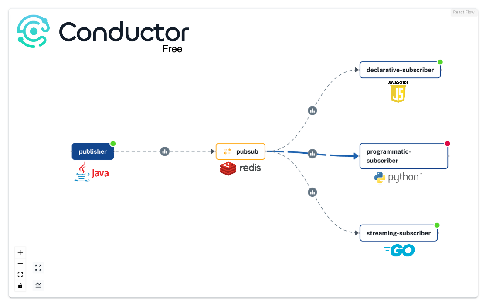
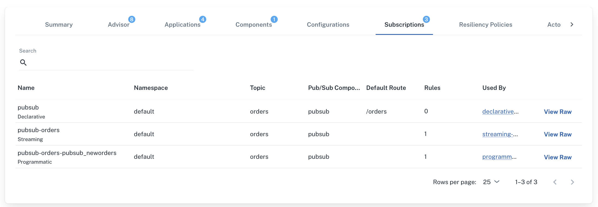

# Dapr Subscriptions Example

## Overview
This project demonstrates the use of Dapr for pub/sub messaging with multiple subscribers using different ways to subscribe and different programming languages. 



## Prerequisites

- [Docker](https://www.docker.com/get-started)
- [Kubernetes](https://kubernetes.io/docs/setup/)
- [Dapr](https://docs.dapr.io/getting-started/install-dapr-cli/)
- [Skaffold](https://skaffold.dev/docs/install/)
- [Redis](https://redis.io/download)
- [Diagrid Conductor](https://www.diagrid.io/conductor)

## Project Structure

- `publisher/`: Java publisher application
- `declarative-subscriber/`: JavaScript subscriber using declarative subscriptions
- `programmatic-subscriber/`: Python subscriber using programmatic subscriptions
- `streaming-subscriber/`: Go subscriber using streaming subscriptions
- `common/`: Common resources and configurations
- `dapr.yaml`: Dapr multi-app run configuration
- `skaffold.yaml`: Skaffold configuration for deployment


## Building the Applications

### Publisher (Java)
```bash
cd publisher
mvn clean package
```

### Declarative Subscriber (JavaScript)
```bash
cd declarative-subscriber
npm install
```

### Programmatic Subscriber (Python)
```bash
cd programmatic-subscriber
pip install -r requirements.txt
```

### Streaming Subscriber (Go)
```bash
cd streaming-subscriber
go mod download
go build
```

## Running with Kubernetes, Skaffold, and Diagrid Conductor

### Install Kubernetes, Dapr 1.14 and Diagrid Conductor (optional)
Follow the steps in the [quickstart guide](https://docs.diagrid.io/conductor/getting-started/quickstart/) to install Kubernetes and Conductor.

### Install Redis
Install Redis using Helm:
```bash
helm repo add bitnami https://charts.bitnami.com/bitnami && helm repo update && helm install redis bitnami/redis --set cluster.enabled=false --set replica.replicaCount=0 --set fullnameOverride=dapr-dev-redis
```

### Install Skaffold (optional)
To install Skaffold, use the following command:
```bash
brew install skaffold
```

### Deploy the application
To deploy the applications to a Kubernetes cluster:

```bash
skaffold dev
```

This command will build the Docker images, deploy the applications, and watch for changes.


## Running with Dapr Multi-App Run CLI

To run all applications using Dapr multi-app run:

```bash
dapr run -f dapr.yaml
```

## Testing the Application

You can test the publisher by sending a POST request:

```bash
curl -X POST http://localhost:5001/pubsub/orders \
-H "Content-Type: application/json" \
-d @order.json
```

Or use the Dapr CLI to publish a message:

```bash
dapr publish --publish-app-id publisher --pubsub pubsub --topic orders --data '{"orderId": "123"}'
```

Or use `test.rest` file from your IDE.

## Monitoring the App with Diagrid Conductor


1. **Subscription Overview**: View all subscription types (declarative, programmatic, and streaming) in one consolidated dashboard in [Conductor](https://conductor.diagrid.io/)



2. **Component Metrics**: Analyze detailed metrics for each subscriber application:
    - Message processing and error rates
    - Latency statistics

3. **Application Networking**: Examine networking metrics for each application:
    - Incoming and outgoing traffic rates
    - Network latency

4. **To view received messages and application behavior**: check the logs from skaffold or dapr CLI.


## Local Development Workflow

1. Make changes to the application code or Dapr configurations (for Java, you must rebuild the Jar files).
2. If using `skaffold dev`, changes will be automatically detected and redeployed.
3. If using dapr run approach, restart the Dapr multi-app run after making changes.

## Additional Resources

- [Blog Post on Dapr Subscriptions](https://www.diagrid.io/blog)
